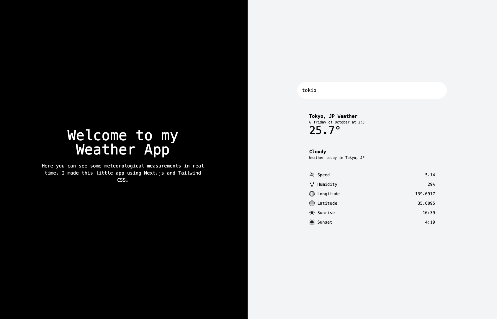
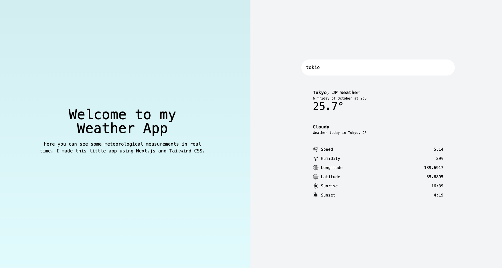

# Weather App

## Description

Weather App is a simple web application that allows you to retrieve real-time weather information for any city. This application utilizes data from the OpenWeatherMap API and displays details such as the current temperature, weather description, wind speed, humidity, sunrise and sunset times, and geographical coordinates.

## Screenshots


_Dark Mode_


_Light Mode_

## Technologies Used

- React
- Next.js
- Tailwind CSS

## Features

- Search for weather information for any city.
- Fetches real-time data from the OpenWeatherMap API.
- Displays temperature in degrees Celsius.
- Provides additional information such as weather description, wind speed, and more.

## Installation and Usage

1. Clone the repository to your local machine:

   ```bash
   git clone https://github.com/robinglto/weatherapp.git
   ```
